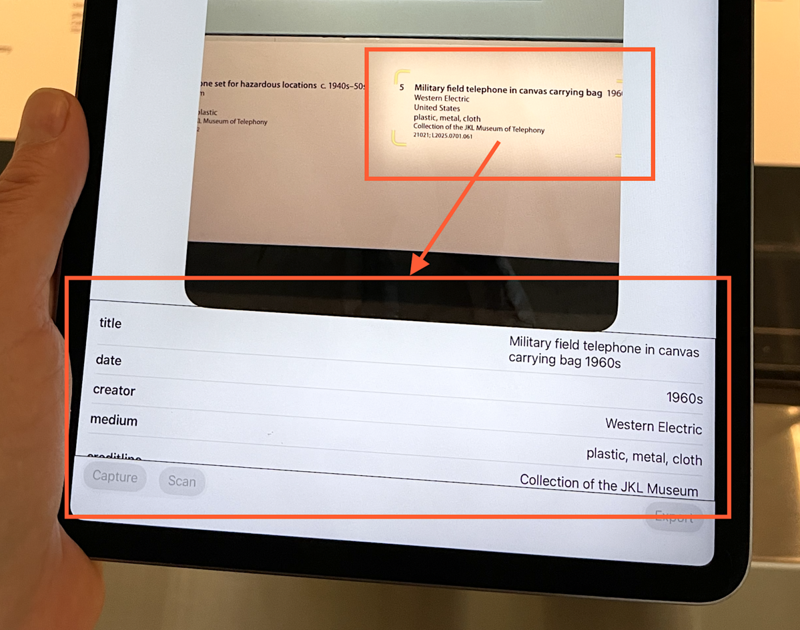
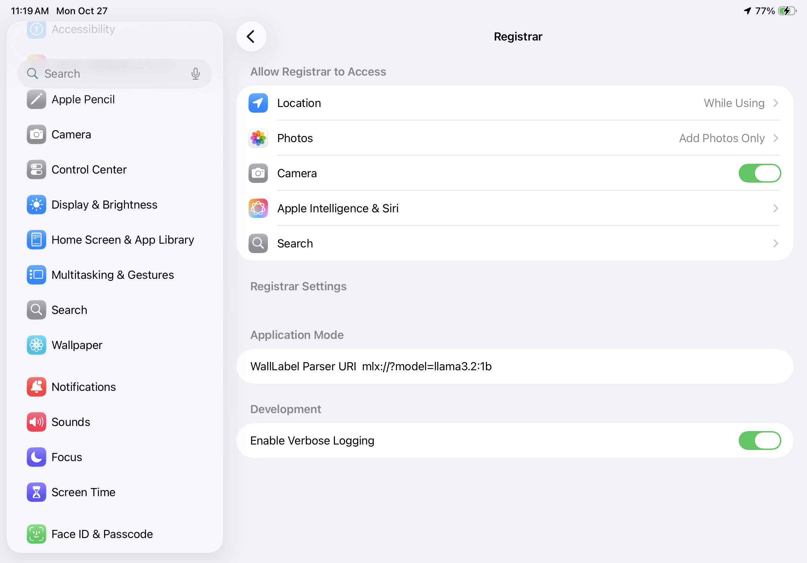

# Registrar



Experimental iOS application for gathering exhibition object photos and wall label data and embedding the latter in the `UserComment` EXIF tag of the former.

## Background

[Registrar – Experiments with Apple's on-device machine-learning frameworks](https://millsfield.sfomuseum.org/blog/2025/10/16/registrar/)

## Motivation

This is an experimental iOS application for gathering exhibition object photos and wall label data and embedding the latter in the `UserComment` EXIF tag of the former. The idea is to use the `DataScanner` framework and on-device machine-learning models (using either the `FoundationModel` framework available with AppleOS 26 or the Swift bindings for Apple's [MLX](https://opensource.apple.com/projects/mlx/) libraries to use third-party models) to scan and then convert camera-imagery of wall label text in to structured data (embedding it in one or more photos).

The idea is to speed up data collection for use in generating embeddings or other ML-related products (LLMs) to allow causual in-terminal photos to be paired with the canonical record for that object using ML/AI techniques.

The data collection piece _mostly_ works. What that means is that photo capture, data scanning (mostly), list views, EXIF updates and saving photos to the device all work. The `FoundationModel` and `MLX` pieces to convert the scanned data (text) in to structured data only sometimes works. When it doesn't work there are no errors triggered or reported but the on-device models are unable to derive any structured data.

Under the hood this package is using the [sfomuseum/Docent](https://github.com/sfomuseum/Docent) package to manage LLMs. That package, in turn, uses the [ml-explore/mlx-swift-lm](https://github.com/ml-explore/mlx-swift-lm) package to load MLX-compatible models from HuggingFace. There are a couple things to note about MLX models: 1) There is currently no visual feeback to indicate that a model is being downloaded (versus running) 2) Many of the MLX models on the [mlx-community HuggingFace organization](https://huggingface.co/mlx-community) are too big to run on iOS devices. There is currently no guidance on which models to use (suggestions and contributions are welcome) so until then it will require a bit of trial and error. Note that the default behaviour is to use the iOS 26 "FoundationModel" which is _designed_ to run on iOS devices.

While the data scanning framework is generally stable I have observed that from time to time is will just stop returning text that it has scanned to the application using it.  Processing scanned data on an recent (2023-ish) iPad mini takes a noticeable amount of time, usually measured in seconds.

Maybe better results could be optained by using a [FoundationModel adapter](https://developer.apple.com/apple-intelligence/foundation-models-adapter/) but the same data and prompt (instructions) used to convert text data in to structured data seems to work fine using other models, like `Ollama:devstral` or `llama.cpp:gpt-oss-20b-GGUF`. For example (using `llama.cpp:gpt-oss-20b-GGUF`):

```
Parse the following text as though it were a museum wall label in to unique key value pairs denoting the properties of the wall label, such as: title, date, location, creator, medium, accession number. Keep in mind that their may be other properties as well. Here is the text in question: "Virgin America flight attendant uniform 2007
cotton, polyester, plastic, wool, metal
Collection of SFO Museum Gift of Sirena Lam
Belt: gift of Lisa Larsen
2018.071.017, 2019.032.012, 013, 015, 019
L2023.1401.072-.076"

{
  "title": "Virgin America flight attendant uniform",
  "date": "2007",
  "medium": ["cotton","polyester","plastic","wool","metal"],
  "item_type": "Uniform",
  "collection": "SFO Museum",
  "provenance": "Gift of Sirena Lam",
  "belt_provenance": "Gift of Lisa Larsen",
  "accession_numbers": [
    "2018.071.017",
    "2019.032.012",
    "2018.071.013",
    "2018.071.015",
    "2018.071.019",
    "L2023.1401.072-076"
  ],
  "location": "San Francisco International Airport Museum",
  "creator": "Virgin America",
  "notes": "Includes belt component"
}
```

_This also works with smaller models like `Qwen_Qwen3-1.7B-GGUF_Qwen3-1.7B-Q8_0.gguf` (described below)._

## "Parsers"

The `Registrar` application uses the [sfomuseum/Docent](https://github.com/sfomuseum/Docent) Swift package for managing the machine-learning model(s) used to derive structured data from wall label text.

The `Docent` package defines the concept of "parsers", each declared by a URI string, to define the type of machine-learning model to use for parsing label text.

The default parser for the `Registrar` application is the built-in `FoundationModel` provided by AppleOS 26. If you have an Apple "silicon"  device (one that uses an M1 processor or higher) that is not running AppleOS 26 or has Apple Intelligence displayed you can use third-party models by enabling support for the [MLX](https://github.com/sfomuseum/Docent?tab=readme-ov-file#mlx) parser.

This is done in the `Registrar` application's "Settings" panel in the "Docent Parser URI" setting. For example:



`MLX` parser URIs take the form of:

```
mlx://?model={MODEL_NAME}
```

As of this writing there is a fixed list of models available to the MLX parser. This will be expanded in future releases. Please consult the [sfomuseum/Docent](https://github.com/sfomuseum/Docent?tab=readme-ov-file#mlx) documentation for details.

There are (eventual) plans for the `Docent` package to also support the use the [llama.cpp Swift bindings](github.com/ggml-org/llama.cpp?tab=readme-ov-file#xcframework) and once that happens this application will be updated accordingly.

## Related

* [sfomuseum/Docent](https://github.com/sfomuseum/Docent) – Swift package for managing the machine-learning model(s) used to derive structured data from wall label text.
* [sfomuseum/go-registrar](https://github.com/sfomuseum/go-registrar) - Tools for extracting data written to the `UserComment` EXIF tag in photos exported by the `Registrar` application.

## See also

* https://developer.apple.com/documentation/technologyoverviews/foundation-models/
* https://developer.apple.com/documentation/visionkit/datascannerviewcontroller
* https://developer.apple.com/documentation/photokit
* https://developer.apple.com/documentation/corelocation/
